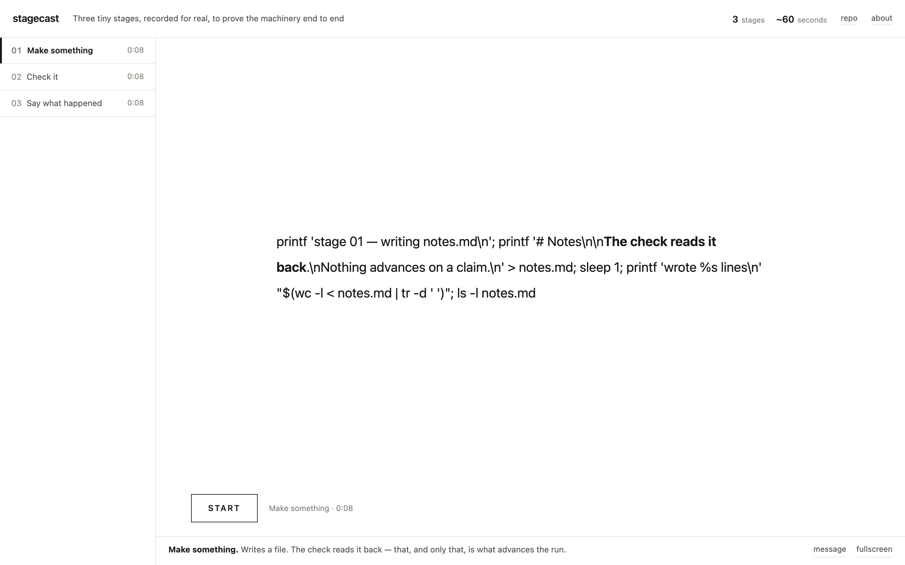

# stagecast

Record an agent doing a long job, and publish it as something people can
actually watch.

Not a screen recorder. The problem it solves is that a three-hour agent session
is unwatchable and unverifiable: the interesting parts are minutes apart, the
prompts scroll away before anyone can read them, and nothing distinguishes a
stage that finished from a stage that *said* it finished.

```
stagecast.toml ──▶ record ──▶ build ──▶ a chaptered site
```

One file describes the run. Each stage is a chapter, each chapter opens on the
message it was sent, and **a stage advances only when its check passes** — never
because the agent looked finished.

---

## Why a check, and not the agent's word

```toml
[[stage]]
id     = "06"
name   = "Network model"
prompt = "prompts/06-nma.md"
stall  = "130m"
verify = "test -d 06_analysis/tables && ls 06_analysis/figures/*.png >/dev/null 2>&1"
```

`verify` runs with the working directory at the project and decides on its own
whether the stage is done. That is the whole discipline. An agent can report work
it did not do — it is a thing agents do — and a recording of one doing it is
worth nothing. A check against the artefact cannot be talked round.

It also removes the problem that costs the most time in practice: telling a
finished stage from a working one. Claude Code animates a spinner while it works
and prints one of the same glyphs in the line it leaves when a turn **ends**, so
a driver reading the screen waits forever. One stage sat for 84 minutes with its
output already on disk. See [docs/LESSONS.md](docs/LESSONS.md).

---

## Use

```sh
brew install asciinema tmux        # and agg, if you want GIFs
uv tool install playwright         # for `stagecast verify`

cp -r example/ my-run && cd my-run
$EDITOR stagecast.toml             # chapters, prompts, checks
stagecast record                   # one recorded session per stage
stagecast build                    # restore, trim, redact, render
stagecast verify https://…         # drive the published page in a browser
```

`build` writes `site/` — a single page, its casts, and the prompts as data.
Host it anywhere static.

### Try it in five minutes

```sh
cd demo && ../stagecast all        # three real stages, about 5 minutes
cd site && python3 -m http.server  # then open localhost:8000
```

The demo drives a plain `bash` rather than an agent, so it needs no API key and
nothing is mocked: each stage writes a file and the next stage's check reads it
back. It is the same machinery a three-hour run uses, small enough to watch.



Every chapter opens on the message it was sent — full width, keywords bold —
and hands over to the player on START.

---

## What it does between record and publish

| | |
|---|---|
| **restore** | keep the longest cast per stage. A skipped stage still opens and closes a session, leaving a one-second stub where the real recording was |
| **trim** | cut from the last substantial output. A stalled stage is not idle — a spinner is an event — so `--idle-time-limit` cannot reach it. One segment ran 5,552 seconds of which 674 were work |
| **redact** | scan every cast against `.env` and against token shapes, replacing with a marker **padded to the original length**. A real key was found in two casts minutes before they would have gone to a public repository |
| **lint** | scan the recordings for shapes only the harness can leave — paste markers, a stray ESC, a quit spliced into output that had not finished. Each one passed its stage check and was found by eye; `tests/` keeps a known-broken cast so the lint cannot quietly stop matching |
| **render** | measure each chapter's *played* length, refuse to publish one under `min_chapter_seconds` (30 by default), and fill the template |

Emptiness is a failure mode, not an edge case: a publish of ten one-second stubs
once passed every control assertion, because the controls worked perfectly on top
of an empty recording.

---

## The look is part of it

White, and no dark version. Frames from these recordings go onto slides, and a
slide is white — so a tinted page draws a rectangle around the terminal and a
dark one puts a black surround on a white screen. One ground, `#ffffff`, from the
page through the player to the fullscreen backdrop.

Six colours, no accent. Emphasis is weight and space.

The terminal is **118 × 28**, which is 16:9 once the cell aspect is measured
rather than assumed. Chapter briefs are 21px over 62 characters, because they are
meant to be read standing still.

Full specification, with the reasoning: [docs/DESIGN.md](docs/DESIGN.md).

---

## Where it came from

Recording a ten-stage systematic review and meta-analysis end to end
([meta-pipe](https://github.com/htlin222/meta-pipe)), over three days, badly,
several times. Every rule in [docs/LESSONS.md](docs/LESSONS.md) is there because
something broke — including the ones that look obvious.

The two that cost the most:

- **A status code proves a file was served, not that anything rendered.** Three
  defects shipped green through status checks and source greps: a player that
  drew nothing, a message block that was a black slab, and near-white text that
  was invisible on white. `stagecast verify` drives the real page in a real
  browser and clicks every control, because a button you can see is not a button
  you can press.

- **Check and prompt must come from one place.** Seven stalls in one project were
  the same mismatch — the prompt said "write the protocol", the check demanded a
  filename nobody had asked for. Keeping both in `stagecast.toml` is not tidiness;
  it is what makes the drift visible.

MIT.
